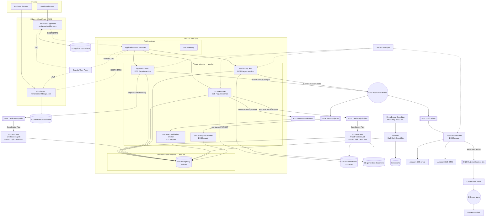
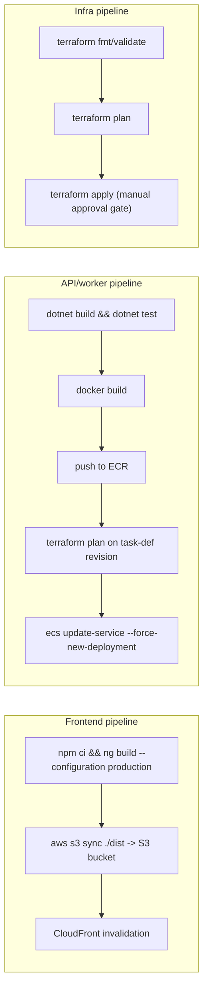

# Northbridge Lending — Cloud Architecture Design

Status: Final — Platform/DevOps Team Deliverable
Cloud provider: **AWS**
Business use case: Digital loan application & approval platform

---

## 1. Business Use Case

**Northbridge Lending** is a digital lender. Borrowers ("applicants") apply for a loan
through a self-service portal, upload supporting documents (ID, income proof, bank
statements), and track their application status. Underwriters ("reviewers") work a
queue of submitted applications, inspect documents and an automatically generated
credit/risk score, and approve or reject each application. Every status change
notifies the applicant by email/SMS. Every night, a report flags applications that
have gone stale (no decision after N days) for the operations team.

This maps 1:1 onto the architecture brief:

| Brief component | Northbridge concept |
|---|---|
| 2 Angular SPAs | Applicant Portal, Reviewer Console |
| 3 .NET APIs | Applications API, Documents API, Decisioning API |
| 2 service-triggered workers | Document Validation Worker, Application Status Projector |
| 1 time-based worker | Daily Stale-Application Report |
| 2 fire-and-forget workers (>20min) | Credit Scoring & Risk Job, Document Fraud/Forensics Job |
| 1 Postgres DB | Northbridge core DB (applicants, applications, documents, decisions) |
| 3 buckets | `raw-documents` (encrypted), `generated-documents`, `reports` |
| 1 notification service | Notification Worker (email/SMS, retry + DLQ) |

---

## 2. Cloud Provider Selection

**Decision: AWS.**

| Criterion | AWS | Azure |
|---|---|---|
| Containers w/ auto-scaling | ECS Fargate / App Runner — simple, no cluster ops | Container Apps / AKS — comparable, slightly more moving parts for App Runner-equivalent simplicity |
| Static SPA + CDN | S3 + CloudFront | Storage Static Website + Front Door/CDN |
| Managed Postgres | RDS for PostgreSQL (Multi-AZ) | Azure Database for PostgreSQL Flexible Server |
| Messaging (queue + pub/sub + scheduler) | SQS + SNS + EventBridge (Scheduler) — three well-understood, separately-scalable primitives | Service Bus + Event Grid — similar capability, bundled differently |
| Long-running async compute (>20min, high CPU/mem) | ECS Fargate `RunTask` — no timeout ceiling, CPU/mem configurable per task | Container Apps Jobs — comparable but younger product |
| Secrets | Secrets Manager | Key Vault |
| Org familiarity / .NET support | Excellent (AWSSDK.* first-class), no lock-in to Azure-only .NET tooling | Excellent — arguably more "native" for .NET, but not a requirement here |

Both clouds could do this well. AWS is chosen because: SQS/SNS/EventBridge map onto
the three background-trigger types (service-triggered / time-based / fire-and-forget)
with minimal impedance mismatch; ECS Fargate `RunTask` cleanly avoids the "fire-and-
forget job needs >20 minutes" constraint without inventing a workaround (an App
Service/Container App with a request-scoped worker would need extra care to avoid
platform request timeouts); and S3 pre-signed URLs are a long-standing, simple
pattern for the frontend's direct-to-storage upload/download requirement.

---

## 3. Service Mapping Table

| # | Component | AWS Service | Notes |
|---|---|---|---|
| 1 | Applicant Portal (Angular CSR) | S3 (static website) + CloudFront + ACM | Own S3 bucket + own CloudFront distribution — independent deploys |
| 2 | Reviewer Console (Angular CSR) | S3 (static website) + CloudFront + ACM | Same pattern, separate distribution |
| 3 | Applications API (.NET) | ECS Fargate service behind ALB | Auto-scaling on CPU/RPS target tracking |
| 4 | Documents API (.NET) | ECS Fargate service behind ALB | Same cluster, separate service/task def |
| 5 | Decisioning API (.NET) | ECS Fargate service behind ALB | Same cluster, separate service/task def |
| 6 | Document Validation Worker | ECS Fargate task, SQS-driven (long-polling `IHostedService` loop, min 1 task, scales on queue depth) | Service-triggered |
| 7 | Application Status Projector | ECS Fargate task, SQS-driven (subscribed to an SNS topic fed by EventBridge/API events) | Service-triggered |
| 8 | Daily Stale-Application Report | EventBridge Scheduler (cron) → Lambda (container image) | Time-based |
| 9 | Credit Scoring & Risk Job | SQS queue → EventBridge Pipe → ECS `RunTask` (one-shot, high CPU/mem, no timeout) | Fire-and-forget, >20min |
| 10 | Document Fraud/Forensics Job | SQS queue → EventBridge Pipe → ECS `RunTask` (one-shot, high CPU/mem, no timeout) | Fire-and-forget, >20min |
| 11 | Core database | RDS for PostgreSQL 16, Multi-AZ | Private subnets, automated backups, IAM auth optional |
| 12 | `raw-documents` bucket | S3, SSE-KMS encrypted | Applicant uploads via pre-signed PUT URL |
| 13 | `generated-documents` bucket | S3, SSE-S3 | Approval letters, OCR/analysis output |
| 14 | `reports` bucket | S3, SSE-S3 | Daily reconciliation report output |
| 15 | Notification Worker | SQS consumer (ECS Fargate service) → SES (email) / SNS (SMS) | Retry + DLQ |
| — | Event bus | Amazon SNS (`application-events` topic) + EventBridge (scheduler + event bus for future rules) | Fan-out backbone |
| — | Secrets | AWS Secrets Manager | DB creds, 3rd-party API keys |
| — | Auth | Amazon Cognito (user pools) issuing JWTs; ALB/API validate JWT | Applicant pool + Reviewer pool (separate) |
| — | Container registry | Amazon ECR | One repo per API/worker image |
| — | Observability | CloudWatch Logs/Metrics/Alarms, X-Ray (optional) | DLQ depth alarm, ECS task failure alarms |

---

## 4. Architecture Diagram (Deployment View)

---

## 5. Background Service Design

### 5.1 Service-triggered (2)

**Document Validation Worker** — when `Documents API` finishes an S3 upload it
publishes a message to SQS queue `document-validation`. The worker is an ECS Fargate
service (min 1 task, scale-out on `ApproximateNumberOfMessagesVisible`) running a
long-poll `IHostedService` loop (`AWSSDK.SQS` `ReceiveMessageAsync`, 20s long-poll).
On success it deletes the message; on failure it lets SQS visibility timeout expire
so the message redelivers (up to `maxReceiveCount`, then to a DLQ).

**Application Status Projector** — subscribes to the `application-events` SNS topic
via its own SQS subscription (`status-projector` queue). Any API publishing a status
change (submitted → in-review → approved/rejected) triggers this worker, which
updates a denormalized status/read-model row reviewers query from, decoupling the
Reviewer Console's read path from the transactional write path.

Both are "reliable response to a trigger" workloads — SQS's at-least-once delivery
+ DLQ redrive policy is the reliability mechanism the brief asks for.

### 5.2 Time-based (1)

**Daily Stale-Application Report** — an **EventBridge Scheduler** rule
(`cron(0 2 * * ? *)`, i.e. 02:00 UTC daily) invokes the `DailyStaleReportJob` **Lambda
function** directly via the schedule's IAM role (`lambda:InvokeFunction`), the same
customer-managed-role invocation model the fire-and-forget jobs' EventBridge Pipes use
for `ecs:RunTask`. Lambda over a standing ECS task definition here because the job is
short, low-resource, and runs once a day — no cluster/service to manage, and no idle
compute billed between runs. It's packaged as a container image (not a zip) so it
reuses the same ECR-push CI flow as every other service in this stack, and it's
attached to the private app subnets so it can reach RDS and (via the S3 gateway
endpoint) write its report with no NAT/internet egress needed.

**Preventing double-fire**: EventBridge Scheduler itself has at-least-once semantics,
and ECS `RunTask` could theoretically be invoked twice (retried delivery, manual
re-run, clock skew across scheduler infra). The job takes a **Postgres advisory lock**
(`pg_try_advisory_lock(<fixed key>)`) as its first action; if the lock is already
held, the second invocation exits immediately as a no-op. This is simpler and
cheaper than provisioning a distributed lock service, and Postgres is already a hard
dependency for the whole system.

### 5.3 Fire-and-forget, >20 minutes (2)

**Credit Scoring & Risk Job** and **Document Fraud/Forensics Job** are triggered by
an API enqueueing a message (loan application ID / applicant ID) onto a dedicated
SQS queue and returning `202 Accepted` immediately — see §6 for the full pattern.

---

## 6. Fire-and-Forget Job Design

**Problem**: the job needs >20 minutes and more CPU/memory than the request-serving
API containers; the API must not block the HTTP request thread waiting for it.

**Pattern**:

1. `Applications API` (on submit) or `Documents API` (on final document upload)
   writes a `job_queue` row (status=`queued`) inside the same DB transaction as the
   business write, then calls `SendMessageAsync` to push `{ jobId, applicationId }`
   onto `credit-scoring-jobs` or `fraud-analysis-jobs` SQS. The controller returns
   `202 Accepted` with a `Location` header pointing at a status-polling endpoint —
   no synchronous wait.
2. An **EventBridge Pipe** (`SQS → ECS RunTask`, no Lambda in the middle) reads the
   queue and starts one Fargate task per message via `ecs:RunTask`, passing the
   message body as a container `overrides.environment` value. This avoids needing a
   permanently-running poller for these two queues — capacity is created on demand.
3. The task definition for both jobs specifies **4 vCPU / 8-16 GB memory** (well
   above the 0.5 vCPU/1GB APIs use) and **no application-level timeout** — Fargate
   tasks are billed and bounded by their own lifecycle, not an API Gateway/ALB
   30-60s idle timeout, so a 45-minute job is not a special case.
4. On completion the job updates `job_queue.status` (`succeeded`/`failed`) and the
   underlying business row (e.g. `loan_applications.risk_score`), then publishes a
   `decision-input-ready` or `fraud-scan-complete` event to the `application-events`
   SNS topic so downstream consumers (notification worker, status projector) react.
5. If the task crashes, ECS marks it `STOPPED` with a non-zero exit code; a
   CloudWatch alarm on `RunTaskFailed`/task exit code notifies ops, and the
   `job_queue` row stays `queued`/`running` past an expected SLA, which the daily
   stale-report job also flags.

This keeps the API layer fully decoupled: it never opens a connection that outlives
the HTTP request, and the heavy compute runs in a right-sized, independently-scaled
container.

---

## 7. Notification Service Design

**Function**: send email (SES) and SMS (SNS) notifications on application status
changes and decisions; webhook support is a future extension point (same queue, a
different consumer).

**Flow**:

1. Any service publishes a notification-worthy event to SNS topic
   `application-events`.
2. An SQS queue `notifications` is subscribed to that topic (fan-out).
3. `NotificationWorker` (ECS Fargate service, 2+ tasks for availability) long-polls
   `notifications`, resolves the applicant's contact preferences, and calls SES
   (email) or SNS (SMS).
4. **Retry strategy**: the SQS queue's redrive policy sets `maxReceiveCount = 5`.
   Within the worker, transient send failures (e.g. SES throttling) are retried with
   **exponential backoff + jitter** (200ms, 400ms, 800ms, 1600ms, 3200ms) inside a
   single message processing attempt; if all in-process retries fail, the worker lets
   the message become visible again (SQS-level redelivery) rather than deleting it,
   so failures are retried both within a receive and across receives.
5. **Dead-letter queue**: after 5 total receives without a successful delete, SQS
   automatically moves the message to `notifications-dlq` (redrive policy). Nothing
   further is retried automatically.
6. **Failure alerting**: a CloudWatch Alarm on `ApproximateNumberOfMessagesVisible`
   for `notifications-dlq` (threshold ≥ 1) publishes to an `ops-alerts` SNS topic,
   which fans out to an ops email/Slack-webhook subscription. A scheduled operator
   review (or a small replay tool) can re-drive DLQ messages back to the main queue
   after fixing the root cause.

---

## 8. Networking & Security

**VPC layout** (`10.20.0.0/16`, 3 AZs):

| Subnet tier | CIDR pattern | Contents |
|---|---|---|
| Public | `10.20.0.0/24`, `.1.0/24`, `.2.0/24` | ALB, NAT Gateways |
| Private (app) | `10.20.10.0/24`, `.11.0/24`, `.12.0/24` | ECS Fargate tasks (APIs + workers) |
| Private (data) | `10.20.20.0/24`, `.21.0/24`, `.22.0/24` | RDS (no route to internet at all, not even via NAT) |

- ALB is the **only** internet-facing compute entry point; CloudFront talks to the
  ALB over HTTPS using a custom origin header the ALB's listener rule checks, to stop
  people bypassing CloudFront and hitting the ALB directly.
- Security groups: `sg-alb` (443 from `0.0.0.0/0`) → `sg-api` (container port from
  `sg-alb` only) → `sg-rds` (5432 from `sg-api` and `sg-worker` only). Workers get
  their own `sg-worker` with egress to S3/SQS/SNS (via VPC endpoints, see below) and
  to `sg-rds`; no ingress at all.
- **VPC endpoints** (gateway for S3, interface for SQS/SNS/Secrets Manager/ECR) keep
  traffic between the private subnets and AWS services off the public internet and
  avoid NAT data-processing charges for high-volume S3/SQS traffic.
- S3 buckets: default "Block Public Access" on all three; `raw-documents` uses
  SSE-KMS with a customer-managed key (CMK) so key usage is independently auditable
  via CloudTrail; access is exclusively through the APIs' pre-signed URLs or task
  IAM roles — no bucket policy grants public or cross-account access.

**IAM / RBAC**:

- Each ECS task definition has its own **task role** (least privilege): e.g.
  `DocumentsApiTaskRole` can `s3:PutObject`/`GetObject` only on `raw-documents/*` and
  `sqs:SendMessage` only on the two queues it enqueues to — it cannot read the
  `reports` bucket or send to the notifications queue directly.
- Human access (reviewers acting on the AWS console, break-glass) is via SSO-federated
  IAM roles, not IAM users; no long-lived access keys.

**Secrets management**: DB connection string, SES/SNS config, and any third-party
credit-bureau API key live in **AWS Secrets Manager**, injected into ECS tasks as
`secrets` (not `environment`) in the task definition, so values never appear in
`ecs describe-task-definition` output in plaintext logs and rotate independently of
a deploy. Lambda has no equivalent of the ECS `secrets` block, so the one Lambda in
this stack (`DailyStaleReportJob`) instead fetches the DB credentials itself at cold
start via `secretsmanager:GetSecretValue`, scoped by IAM to that one secret's ARN.

**Authentication**: **Amazon Cognito** — two user pools, `applicants` and
`reviewers`, issuing JWTs on login. The Angular SPAs use the Cognito Hosted UI /
Amplify-style OIDC flow and attach the JWT as a Bearer token on API calls. The ALB
listener performs JWT validation at the edge (`authenticate-cognito` action) before
forwarding to the target group; each .NET API additionally validates the JWT's
`aud`/`iss`/expiry via standard ASP.NET Core JWT bearer middleware (defense in depth,
and required for any client that talks to the API directly, not through this ALB).

---

## 9. CI/CD Pipeline

Three independent pipelines (GitHub Actions), matching the three deployable
component families — this preserves the "independently deployed" micro-frontend
requirement and lets an API or worker ship without redeploying anything else.

- **Frontend**: `applicant-portal` and `reviewer-console` each have their own
  workflow, triggered on changes under their own path (`paths:` filter), so one SPA's
  release never touches the other's CloudFront distribution.
- **APIs/workers**: build → unit test → Docker build → push to a per-service ECR
  repo → register a new task definition revision → `aws ecs update-service`. Rolling
  deployment via ECS's own deployment controller (min healthy percent 100%, max 200%)
  gives zero-downtime API releases; workers that are one-shot `RunTask` jobs simply
  pick up the new task-def revision on their next scheduled/triggered invocation —
  no "service" to roll.
- **Infra**: Terraform changes go through plan-then-manual-approval-then-apply,
  kept separate from application pipelines so a schema/network change is never
  bundled silently with an app deploy.

---

## 10. Explicit Answers — Brief Section 5

**5.1 Hosting & Compute**
- Angular SPAs: S3 static website hosting + CloudFront, one bucket/distribution per app.
- .NET APIs: ECS Fargate services behind a shared ALB, auto-scaling on CPU/RPS.
- Fire-and-forget jobs (>20min): ECS Fargate `RunTask` (one-shot tasks, not services), 4 vCPU/8-16GB, no application-imposed timeout — decoupled entirely from ALB/API request lifetimes.

**5.2 Background Service Triggers**
- Service-triggered workers: SQS queues (subscribed to SNS `application-events` where fan-out is needed), consumed by long-polling ECS Fargate `IHostedService` workers.
- Daily job: EventBridge Scheduler cron rule invoking `ecs:RunTask` directly; a Postgres advisory lock inside the job prevents double-fire from at-least-once scheduler delivery.
- API enqueue without blocking: controller writes a `job_queue` row + `SendMessageAsync` to SQS inside the request, then returns `202 Accepted` immediately; an EventBridge Pipe (SQS→ECS RunTask) starts the actual compute asynchronously.

**5.3 Data & Storage**
- Managed Postgres: Amazon RDS for PostgreSQL 16, Multi-AZ, automated backups, 7-day+ PITR.
- Object storage: 3 S3 buckets (`raw-documents` SSE-KMS, `generated-documents`, `reports`).
- Pre-signed URLs: yes — `Documents API` issues short-lived pre-signed `PUT` URLs for applicant uploads and pre-signed `GET` URLs for the Reviewer Console to view/download documents, so browsers never get direct IAM credentials and S3 traffic never round-trips through the API.

**5.4 Notification Service**
- Underlying service: Amazon SES (email) + Amazon SNS (SMS), fed by an SQS queue subscribed to the `application-events` SNS topic.
- Retries: in-worker exponential backoff (5 attempts) plus SQS redrive policy (`maxReceiveCount=5`) for cross-attempt redelivery.
- After exhaustion: message moves to `notifications-dlq`; a CloudWatch alarm on DLQ depth notifies ops via SNS → email/Slack; messages are replayed manually after root-causing the failure.

**5.5 Security & Networking**
- Isolation: single VPC, 3-tier subnet layout (public/app/data) across 3 AZs; security groups scoped tier-to-tier; RDS in isolated subnets with no NAT route.
- Secrets: AWS Secrets Manager, injected via ECS task-definition `secrets`, never in plaintext environment variables or source.
- Auth: Amazon Cognito user pools issuing JWTs; ALB validates JWT at the listener, APIs re-validate via ASP.NET Core JWT bearer middleware.
